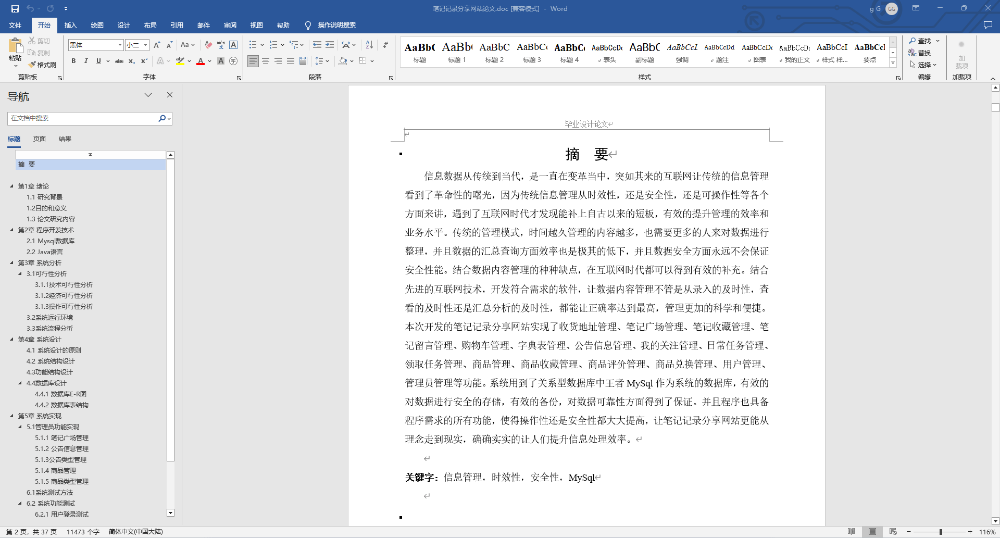
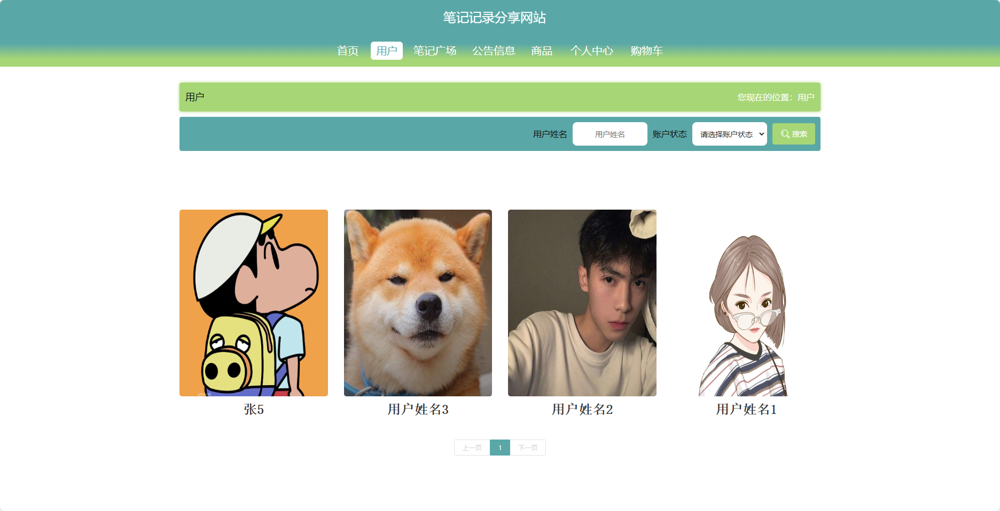
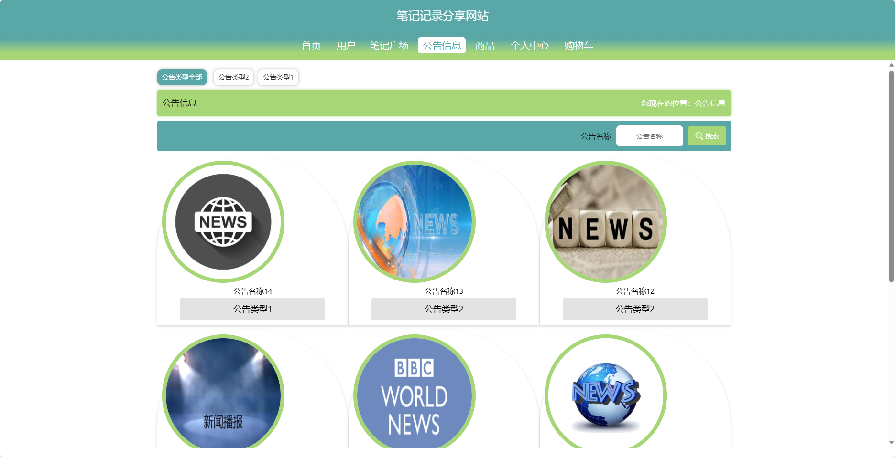
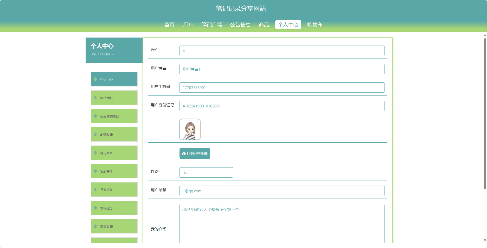
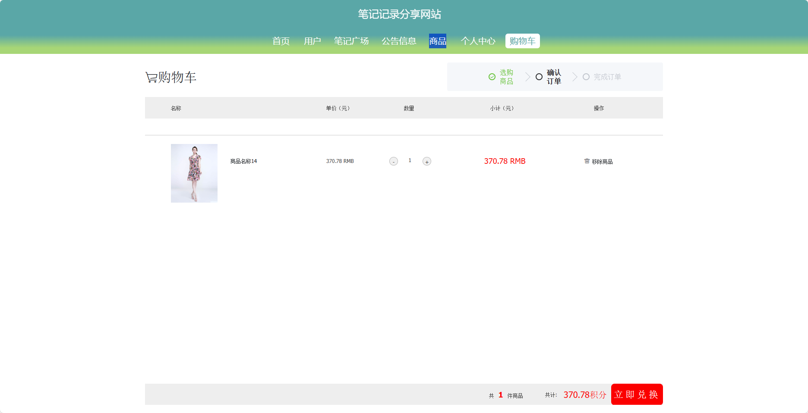
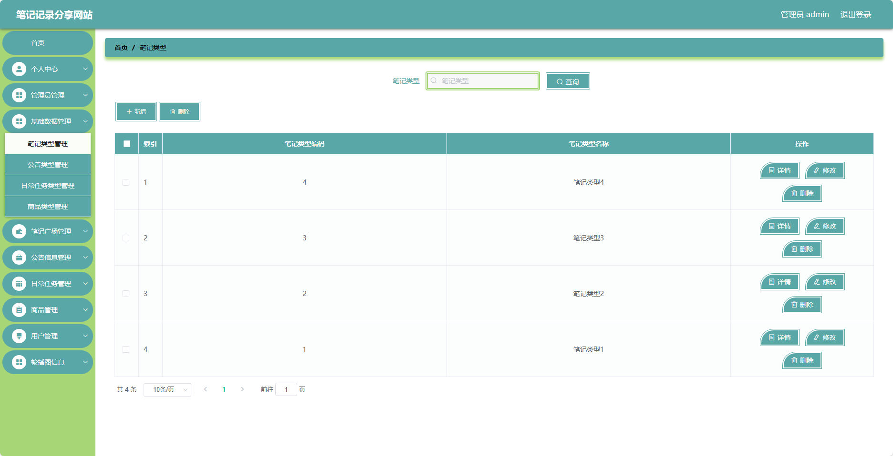
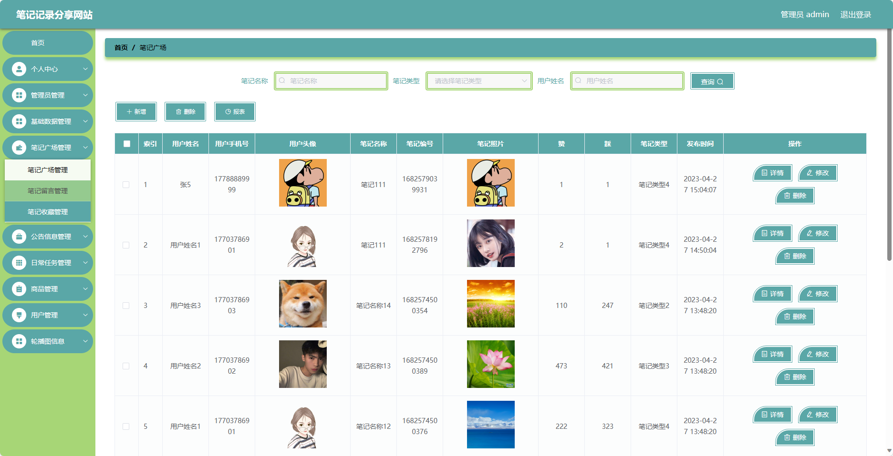

## 基于SpringBoot的笔记记录分享网站(程序+报告)

- <b>完整代码获取地址：从戎源码网 ([https://armycodes.com/](https://armycodes.com/))</b>
- <b>技术探讨、资料分享，请加QQ群：692619798</b> 
- <b>作者微信：19941326836  QQ：952045282</b> 
- <b>承接计算机毕业设计、Java毕业设计、Python毕业设计、深度学习、机器学习</b>
- <b>选题+开题报告+任务书+程序定制+安装调试+论文+答辩ppt 一条龙服务</b>
- <b>所有选题地址 ([https://github.com/YuLin-Coder/AllProjectCatalog](https://github.com/YuLin-Coder/AllProjectCatalog)) </b>
## 项目介绍
基于SpringBoot的笔记记录分享网站，系统包含两种角色：管理员、用户,系统分为前台和后台两大模块，主要功能如下。

### 【管理员】:
- 管理员个人中心：管理员可以管理个人信息，包括修改密码、查看个人信息等。
- 管理员管理：管理员可以管理其他管理员账号，包括添加、删除、编辑等操作。
- 基础数据管理：管理员可以管理系统的基础数据，如网站配置、分类信息等。
- 笔记广场管理：管理员可以管理笔记广场的内容，包括审核、删除违规内容等操作。
- 公告信息管理：管理员可以管理网站发布的公告信息，包括添加、删除、编辑等操作。
- 日常任务管理：管理员可以管理网站的日常任务，如定时备份、数据清理等。
- 商品管理：管理员可以管理网站的商品信息，包括上架、下架、编辑商品信息等操作。
- 用户管理：管理员可以管理用户账号，包括查看用户列表、禁用用户等操作。
- 轮播图信息：管理员可以管理首页轮播图的展示内容。

### 【前台】:
- 首页：展示网站的基本信息、热门笔记、公告等内容。
- 用户：展示注册用户的个人信息和活跃度等。
- 公告信息：展示网站发布的最新公告和通知。
- 笔记广场：用户可以在此发布和分享自己的笔记记录。
- 商品：展示网站相关的商品信息。
- 个人中心：用户可以管理个人信息、查看自己的笔记记录等。
- 购物车：用户可以将感兴趣的商品加入购物车。

## 项目技术
- 编程语言：Java
- 数据库：MySQL
- 项目管理工具：Maven
- 前端技术：HTML、CSS、JavaScript、Jquery、Vue
- 后端技术：Spring、SpringMVC、MyBatis

## 运行环境
- JDK版本：JDK1.8及以上
- 开发工具：IDEA、Ecplise、Myecplise都可以
- 数据库: MySQL5.7及以上
- Maven：maven3.0及以上
- Node：14.14.0及以上

## 运行截图

